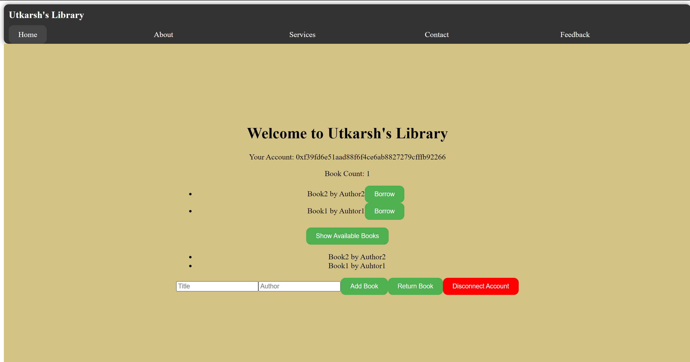

# Metacrafters Intermediate ETH + AVAX Module 2 [Types of Functions]
The project consists of creating Frontend for a smart Contract with functionalities like Withdraw, Deposit, Balance, etc.

## Description

The Frontend for the project has been made using Node.js and React and designed using core CSS

The smart contract is designed in Solidity.

## About the Smart Contract
The smart contract has following functionalities:
1. Adding Books
2. Checking Books
3. Displaying the available books
4. Borrowing the books
5. Returning the books

## About the Frontend
The frontend for the above smart contract has the following functionalities:
1. An appealing UI with fair color choices
2. A Navbar to direct User to various pages
3. A welcome message
4. A Button to connect to the metamask wallet
5. Buttons to addBooks, Borrow and Return books in library
6. Disconnect the account
7. Decide the name of book and author of book

## Getting Started

After cloning the github, you will want to do the following to get the code running on your computer.

1. Inside the project directory, in the terminal type: npm i
2. Open two additional terminals in your VS code
3. In the second terminal type: npx hardhat node
4. In the third terminal, type: npx hardhat run --network localhost scripts/deploy.js
5. Back in the first terminal, type npm run dev to launch the front-end.

After this, the project will be running on your localhost. 
Typically at http://localhost:3000/

## Authors
Utkarsh Singh
Chandigarh University - University Institute of Engineering

## Screenshots

